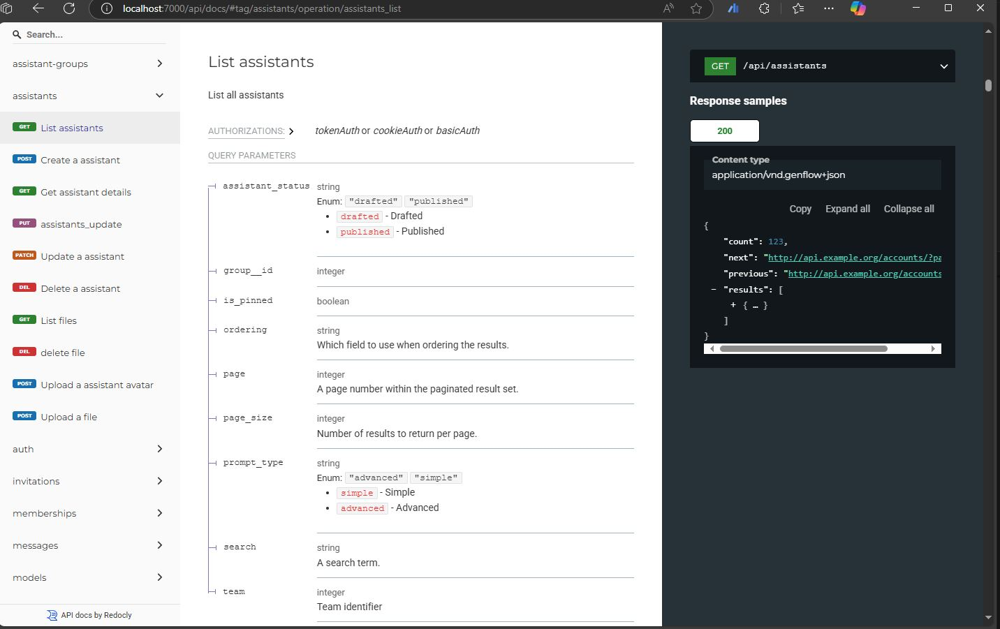
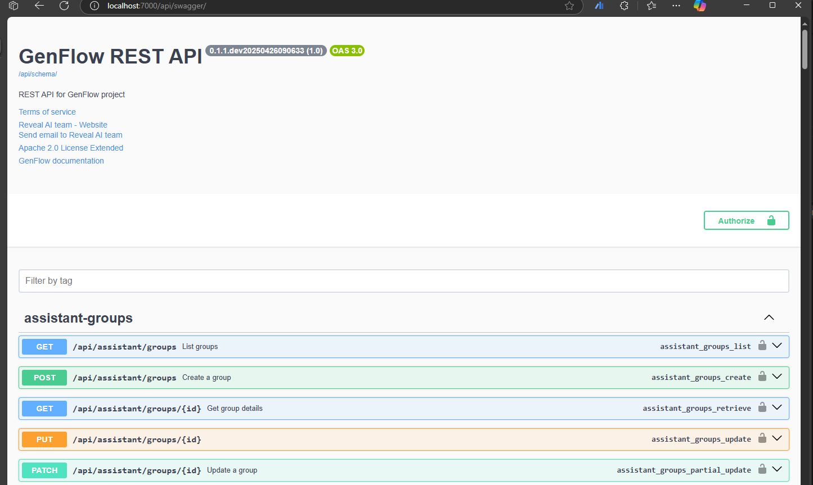

# GenFlow Documentation 📖

Welcome to the GenFlow documentation guide.

## Overview

GenFlow is a low-code platform for building, managing, and deploying Generative AI assistants and prompt workflows.

## Key Concepts

- **Dashboard**: A view of favorite prompts and assistants.
- **Chat**: A chat interface to available LLMs, prompts, and assistants.
- **Prompts**: Templates used to generate AI responses.
- **Assistants**: Configurable GenAI agents for specific tasks.
- **Sessions**: List of recent sessions to continue with.
- **Teams**: Group-based permission and knowledge base structure.

## Getting Started

Follow the [Installation Guide](administration/basics/installation.md) to get started.

## API Reference

1. You first need to login through the admin interface

2. Access API root from the browser using the URL `http://localhost:7000/api/`

3. Access API documentation from the browser using the URL `http://localhost:7000/api/docs/`.

   

4. Access Swagger UI, which is a user interface for exploring and testing RESTful APIs
that is generated automatically from an OpenAPI specification, from the browser using the URL `http://localhost:7000/api/swagger/`.

   

5. To download the OpenAPI 3 schema use the URL `http://localhost:7000/api/schema/`.

## Support

For help, please contact [info@revealai.de](mailto:info@revealai.de)

Happy building with GenFlow!
